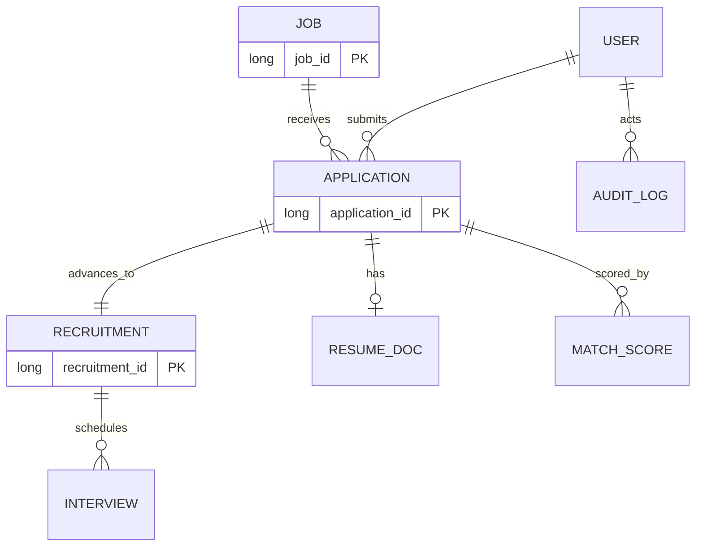

# Phase 2 — Product Model — PS044-SmartHire (Online Job Recruitment System)

_Derived from `project-44-source-requirements.md` (Project 44 PDF) + the product owner's
approved 2026 enhancement scope (approved 2026-09-14). No implementation. Nothing here is
built until approved._

## Classification legend (applied to every item)

- 🟦 **SRC** — Source Requirement (explicit in the Project 44 PDF).
- 🟩 **ENH** — Approved Product Enhancement (owner-approved 2026 scope; not in the PDF).
- 🟨 **ASM** — Assumption (my inference, explicitly labeled; **not** silently invented).
- 🟥 **OQ** — Open Question (needs an owner decision; deliberately left undecided).

**Approved enhancement scope (owner-approved):** React+TS web app · AI-assisted recruitment
(Claude, human-in-the-loop) · resume/document parsing · candidate–job matching + recruiter
assistance · search & filtering · email/notifications · interview scheduling · analytics &
dashboards · audit logging · PII/security/fairness safeguards · production observability,
resilience, CI/CD, security automation.

---

## 1. Personas

| ID | Persona | Class | Goals | Pains |
|----|---------|-------|-------|-------|
| P1 | **Candidate** (job seeker) | 🟦 | Find relevant jobs, apply quickly, know where they stand, hear back on time | Opaque status, silence, clunky apply |
| P2 | **Recruiter** (company hiring user) | 🟦 | Post jobs, sift applicants, shortlist, run interviews, hire | Application volume, manual screening, coordination |
| P3 | **Platform Admin / Operator** | 🟨🟥 | Manage users, review audit logs, monitor health | — _(role not in source; implied by audit #9 + observability #11 — confirm in scope)_ |

- 🟥 **OQ-P1:** Is a distinct **Hiring Manager** persona (separate from Recruiter, e.g. approves final offers) in scope, or is "recruiter" a single combined role? _(Source names only "recruiters." Not inventing a split.)_

## 2. Actors

**Human actors:** Candidate 🟦 · Recruiter 🟦 · Admin 🟨🟥.

**Internal system actors (source infra):** API Gateway 🟦 · Auth Service 🟦 · Eureka registry 🟦.

**External/integration actors (enhancement):** Claude API (AI Assistant) 🟩 · Email/Notification provider 🟩 · Object storage (résumé files) 🟩 · Document parser 🟩.

## 3. Roles & authorization (RBAC)

| Capability | CANDIDATE 🟦 | RECRUITER 🟦 | ADMIN 🟨🟥 |
|---|:--:|:--:|:--:|
| Register / authenticate (JWT) | ✅ | ✅ | ✅ |
| Search / view jobs | ✅ | ✅ | ✅ |
| Post / edit / close a job | — | ✅ | — |
| Apply to a job, upload résumé | ✅ | — | — |
| View own applications & status | ✅ | — | — |
| View applications **for own/company jobs** | — | ✅ | — |
| Shortlist, set interview/final status | — | ✅ | — |
| Schedule interviews 🟩 | — | ✅ | — |
| Use AI assist (ranking/summaries) 🟩 | — | ✅ | — |
| View analytics/dashboards 🟩 | — | ✅ (own/company) | ✅ (all) |
| Manage users / view audit logs 🟩🟨 | — | — | ✅ |

- 🟨 **ASM-R1:** Authorization is **RBAC + object ownership** — a recruiter may only act on jobs/applications belonging to them or their company.
- 🟥 **OQ-R1 (= OQ2):** How are recruiter↔company and candidate↔account modeled? Source has `company_name` as a **string on Job** and a bare `candidate_id`; no user/company schema is given.

## 4. User journeys

**J1 — Candidate (🟦 core; 🟩 marked):**
register/login (🟦) → search & filter jobs (🟩) → view job (🟦) → apply + upload résumé (🟦 apply / 🟩 upload+parse) → receive confirmation (🟩) → track application & recruitment status (🟦) → receive status/interview notifications (🟩) → attend scheduled interview (🟩) → see final outcome (🟦).

**J2 — Recruiter (🟦 core; 🟩 marked):**
login (🟦) → post job (🟦) → view incoming applications (🟦) → AI-assisted ranking/summaries (🟩, advisory) → **human review** → shortlist (🟦) → schedule interview (🟩) → record `interview_status` (🟦) → set `final_status` / hire-reject (🟦) → candidate notified (🟩) → review hiring analytics (🟩).

**J3 — Admin (🟨🟥, only if in scope):** manage users → review audit logs → monitor system health/observability.

## 5. Use cases

| UC | Actor | Description | Class |
|----|-------|-------------|-------|
| UC-01 | Candidate/Recruiter | Register account | 🟨 (implied by JWT; schema OQ2) |
| UC-02 | Candidate/Recruiter | Authenticate, obtain JWT | 🟦 |
| UC-03 | Recruiter | Create/post job | 🟦 |
| UC-04 | Recruiter | Edit / close / reopen job | 🟨 (lifecycle beyond `status`; OQ1) |
| UC-05 | Candidate | List/search/filter jobs | 🟦 list / 🟩 search+filter |
| UC-06 | Candidate | View job detail | 🟦 |
| UC-07 | Candidate | Apply to job | 🟦 |
| UC-08 | Candidate | Upload résumé; parse to structured data | 🟩 |
| UC-09 | Candidate | View own applications & status | 🟦 |
| UC-10 | Recruiter | View applications for a job | 🟦 |
| UC-11 | Recruiter | Get AI match ranking / candidate summary | 🟩 |
| UC-12 | Recruiter | Shortlist a candidate | 🟦 |
| UC-13 | Recruiter | Schedule interview | 🟩 |
| UC-14 | Recruiter | Set `interview_status` | 🟦 |
| UC-15 | Recruiter | Set `final_status` (hire/reject) | 🟦 |
| UC-16 | System | Notify candidate/recruiter of changes | 🟩 |
| UC-17 | Recruiter/Admin | View recruitment analytics | 🟩 |
| UC-18 | System | Write audit log for sensitive actions | 🟩 |
| UC-19 | Admin | Manage users / review audit | 🟨🟥 |
| UC-20 | System | Inter-service call Application→Job (validate) | 🟦 |

## 6. Feature map

- **Identity & Access** 🟦: registration(🟨), JWT login, RBAC, gateway-enforced auth.
- **Jobs** 🟦: create/list/view/close, status; search & filter 🟩.
- **Applications** 🟦: apply, résumé link, status, list per candidate/job; résumé upload+parse 🟩.
- **Recruitment** 🟦: shortlist, interview status, final status, status tracking; interview scheduling 🟩.
- **AI assistance** 🟩: matching/ranking, candidate summaries, JD assistance — human-in-the-loop.
- **Notifications** 🟩: email on status changes / interview invites.
- **Analytics** 🟩: pipeline funnel, time-to-hire, source metrics.
- **Trust & Safety** 🟩: audit logging, PII protection, fairness/bias safeguards.
- **Platform** 🟦/🟩: API Gateway 🟦, Eureka 🟦, load balancing 🟦, inter-service comm 🟦; observability, resilience, CI/CD, security automation 🟩.

## 7. Domain model

**Source entities (🟦 — fields verbatim from PDF):**
- **Job**: `job_id` PK, `company_name`, `role`, `location`, `status`.
- **Application**: `application_id` PK, `job_id` (→Job), `candidate_id` (→User), `resume_link`, `status`.
- **Recruitment**: `recruitment_id` PK, `application_id` (→Application), `interview_status`, `final_status`.

**Enhancement / implied entities:**
- **User/Account** 🟨 (implied by JWT + `candidate_id`; schema is 🟥 OQ2): id, email, passwordHash, role, (company ref 🟥).
- **ResumeDocument** 🟩: id, application_id, storageUrl(=`resume_link`), parsedFields(json), parseStatus.
- **MatchScore** 🟩: id, application_id, job_id, score, rationale, model/promptVersion, createdAt.
- **Interview** 🟩: id, recruitment_id, scheduledAt, mode, outcome.
- **Notification** 🟩: id, recipient, channel(email), template, status, sentAt.
- **AuditLog** 🟩: id, actorId, action, entity, before/after, timestamp.

**Status fields — values are 🟥 OQ1.** Proposed defaults (🟨, for confirmation, not silent invention):
- Job.status: `OPEN | CLOSED | DRAFT`.
- Application.status: `APPLIED | UNDER_REVIEW | SHORTLISTED | REJECTED | WITHDRAWN`.
- Recruitment.interview_status: `NOT_SCHEDULED | SCHEDULED | COMPLETED | NO_SHOW`.
- Recruitment.final_status: `PENDING | HIRED | REJECTED`.

## 8. Business rules

_Tagged; source-silent rules are proposed (🟨) or flagged (🟥), never asserted as source._

- BR-1 🟦: An Application references an existing Job (`job_id`) and a candidate (`candidate_id`).
- BR-2 🟦: A Recruitment record references an existing Application.
- BR-3 🟦: Application/recruitment status is trackable by the owning candidate and the managing recruiter.
- BR-4 🟩: **AI never decides.** AI output is advisory; a human recruiter must confirm any
  shortlist/reject/hire. (From approved scope #2/#10 — firm rule.)
- BR-5 🟩: **Fairness** — AI matching must not use protected attributes (e.g. gender, age,
  race) as features; matching rationale must be explainable and logged. _(Exact protected-
  attribute list & fairness metric = 🟥 OQ-B4.)_
- BR-6 🟩: All sensitive actions (status changes, AI-assisted decisions, data access) are audit-logged.
- BR-7 🟩: `resume_link` = storage URL of an uploaded document; Document Service owns upload→store→parse.
- BR-8 🟨: A candidate may apply to a given job **at most once** (dedupe on job_id+candidate_id). 🟥 OQ-B1 confirm.
- BR-9 🟨: Candidates may apply only to `OPEN` jobs. 🟥 (depends on OQ1).
- BR-10 🟨: Only the job's owning recruiter/company may view its applications & change status (object-level authz; OQ2).
- BR-11 🟨: Status transitions are constrained (e.g. cannot go `HIRED`→`APPLIED`). Exact state machine = 🟥 OQ1.
- 🟥 OQ-B2: Can a candidate withdraw an application? OQ-B3: Can a recruiter reopen/duplicate a job?

## 9. AI responsibilities & human-in-the-loop boundaries (all 🟩)

**AI MAY (advisory only):** parse résumés into structured fields; compute candidate–job
match scores with rationale; rank/annotate an applicant list; summarize a candidate;
assist drafting job descriptions / outreach copy.

**AI MUST NOT (hard boundaries):** shortlist, reject, or hire autonomously; hide or
auto-filter candidates out of a recruiter's view; use protected attributes; make any
irreversible or candidate-facing decision without a human action.

**Human-in-the-loop rules:** every state-changing recommendation requires an explicit
recruiter action; AI outputs show rationale + confidence + model/prompt version; recruiters
can override and the override is logged; AI features run through an **evaluation harness**
(golden sets, regression, safety/bias checks) before release; PII is minimized/redacted
before prompts and never logged in the clear.

- 🟥 **OQ-AI1:** Fairness metric + protected-attribute policy (jurisdiction-dependent).
- 🟥 **OQ-AI2:** Is any AI feature required in the MVP, or all in R2? (See §10.)

## 10. MVP vs later releases (🟨 proposed split — 🟥 confirm)

| Release | Contents |
|---|---|
| **R1 / MVP** (academic-complete + thin product) | **All 🟦 source**: Auth+JWT, Job, Application, Recruitment services, API Gateway, Eureka, load balancing, inter-service comm, unit+integration tests, containerized deploy. **Plus minimal 🟩**: React UI for core flows, résumé upload→link (basic field parse), basic job search/filter, email notification on key status changes, audit-log writes, OpenAPI, Sentry + structured logging, CI pipeline. |
| **R2** | AI matching/ranking + recruiter assistance (HITL + eval harness), richer résumé parsing, interview scheduling, expanded notifications, resilience (circuit breakers), config server. |
| **R3** | Analytics dashboards, semantic/vector search, fairness/bias monitoring + explainability UI, distributed-tracing dashboards, security automation (DAST/pentest in CI), performance hardening. |

Rationale (🟨): R1 must fully satisfy the graded academic source and be demonstrable;
higher-risk/heavier enhancements (esp. AI) land in R2 with proper evaluation. Owner may rebalance.

## 11. Service boundaries (🟨 proposed; 🟥 DB strategy)

**Source services (🟦):** `api-gateway`, `service-registry` (Eureka), `auth-service`
(owns User), `job-service` (owns Job), `application-service` (owns Application; calls
job-service), `recruitment-service` (owns Recruitment; shortlisting + **interview scheduling
lives here**, not a new service).

**Enhancement services (🟩), added only with justification:**
- `document-service` (R1) — résumé upload/store/parse. _Separate: distinct file-handling + parsing concern._
- `notification-service` (R1 basic) — async email. _Separate: async + external provider + retry/backoff._
- `ai-service` (R2) — Claude integration, matching, summaries; owns MatchScore. _Separate: provider isolation + safety boundary + independent scaling._
- `analytics-service` (R3) — read-model/reporting. _Deferable; separate read side._
- `config-server` (R2) — centralized config.

**Deliberately NOT separate services (anti-over-engineering, 🟨):** no dedicated search
service in R1 (search lives in job/application); no scheduling service (in recruitment);
audit is a cross-cutting concern writing to a store, not necessarily its own service.

- 🟥 **OQ-S1:** DB strategy — **database-per-service** (microservice ideal) vs
  **schema-per-service in one PostgreSQL** (simpler for academic delivery)? _(Phase-3 decision.)_
- 🟥 **OQ-S2:** Inter-service comm mechanism — **OpenFeign** vs WebClient; sync vs event-driven (= OQ4, Phase 3).

## 12. Major workflows (services + class)

1. **Post Job** 🟦: Recruiter → Gateway → auth → job-service.create → Job `OPEN`.
2. **Apply to Job** 🟦(+🟩 upload): Candidate → Gateway → application-service.apply →
   (Feign) job-service.validate(job OPEN) → [document-service store/parse 🟩] → Application `APPLIED` → notification 🟩.
3. **AI-assisted shortlisting** 🟩→🟦: recruiter opens applicants → ai-service ranks/summarizes
   (advisory) → **human review** → recruitment-service.shortlist → Application `SHORTLISTED`.
4. **Interview scheduling** 🟩: recruiter schedules → Interview created → notification to candidate.
5. **Status tracking** 🟦(+🟩 notify): candidate/recruiter read status; changes emit notifications.
6. **Hire/Reject** 🟦: recruiter sets `final_status` → notification → audit-log 🟩.

## 13. Acceptance criteria (MVP; Given/When/Then)

- **AC-1 (auth, 🟦):** Given an unauthenticated request to a protected route, When it hits the gateway, Then it is rejected 401; with a valid recruiter/candidate JWT it is authorized per role.
- **AC-2 (post job, 🟦):** Given an authenticated recruiter, When they POST a valid job, Then it is created with `status=OPEN` and appears in job listings.
- **AC-3 (apply, 🟦):** Given an authenticated candidate and an OPEN job, When they apply, Then an Application is created referencing that job & candidate; applying to a non-existent/closed job fails validation (inter-service check to job-service).
- **AC-4 (inter-service + LB, 🟦):** Given ≥2 job-service instances registered in Eureka, When application-service validates a job, Then requests are load-balanced and resolve via discovery (no hard-coded host).
- **AC-5 (recruitment, 🟦):** Given a submitted application, When a recruiter shortlists and sets interview/final status, Then Recruitment reflects the transitions and the candidate can track status.
- **AC-6 (résumé, 🟩):** Given a candidate applying, When they upload a PDF/DOCX résumé, Then it is stored, `resume_link` is set, and basic fields are parsed.
- **AC-7 (notify, 🟩):** Given a status change, When it is persisted, Then the affected candidate receives an email notification.
- **AC-8 (tests+deploy, 🟦):** Given the repo, When CI runs, Then unit + integration tests (Testcontainers) pass and `docker compose up` brings up gateway + eureka + services healthy.
- **AC-9 (AI HITL, 🟩, when R2):** Given AI ranking is shown, When no recruiter action is taken, Then no application status changes (AI never auto-decides).

---

## Consolidated open questions (need owner decisions)

OQ1 status value sets/state machines · OQ2 user & company/recruiter modeling + Auth schema ·
OQ-P1 hiring-manager persona? · OQ-B1 apply-once? · OQ-B2 candidate withdraw? · OQ-B3
reopen/duplicate job? · OQ-AI1 fairness metric + protected attributes · OQ-AI2 any AI in MVP? ·
OQ-S1 DB-per-service vs shared · OQ-S2 Feign vs WebClient / sync vs events (Phase 3) ·
OQ7 deployment target · OQ9 grading rubric/deadline · OQ-P3 is Admin role in scope?
